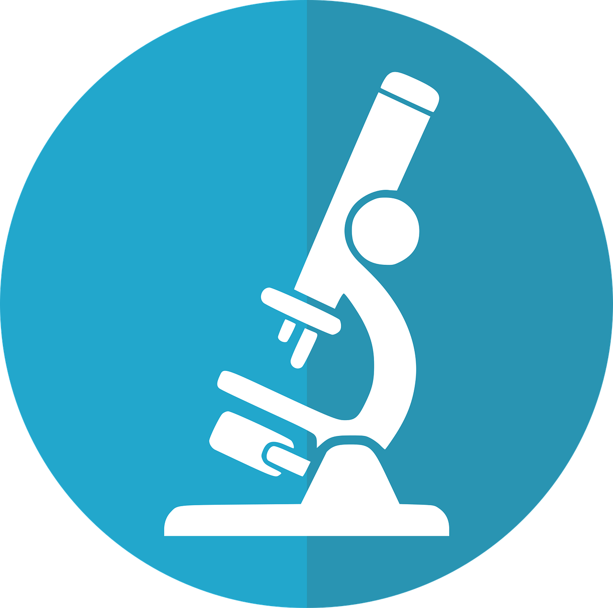
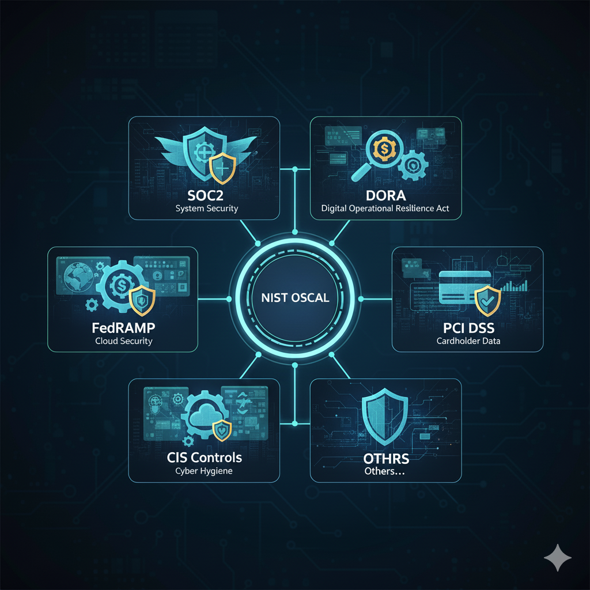

#     Welcome to the OSCAL Compass Labs organization.

The OSCAL Compass Labs organization comprises projects aligned with the OSCAL Compass [project](https://github.com/oscal-compass).

## What's here?

Though not officially part of the [CNCF](https://www.cncf.io/) OSCAL Compass project itself, projects found here have been reviewed by the OSCAL Compass community overseers as having potential beneficial association. The OSCAL Compass project has adopted [NIST OSCAL](https://pages.nist.gov/OSCAL/) as the language for machine readable compliance documents representation, and aims to facilitate its adoption and evolution.

##### New projects

This is the place for research and development comprising new projects that align with the OSCAL Compass mission of compliance standardization/automation. For example, a hypothetical new project may provide means to employ AI for fabrication of OSCAL artifacts. Or a new project may provide a user-friendly UI to assist with agile authoring.

##### Existing projects moved into the OSCAL Compass sphere

A compliance standardization/automation existing project may very well start its life outside the bounds OSCAL Compass. At some point it may make sense to join with OSCAL Compass. The first step is to become a project under the OSCAL Compass Labs organization, garnering all the benefits of being so associated. Later, if warranted, the project may graduate to OSCAL Compass proper.

## Getting Started

Check out the OSCAL Compass [community](https://github.com/oscal-compass/community/tree/main) and [governance](https://github.com/oscal-compass/community/blob/main/GOVERNANCE.md) pages to get started.

-----
-----

##### NIST OSCAL machine readable standardization

